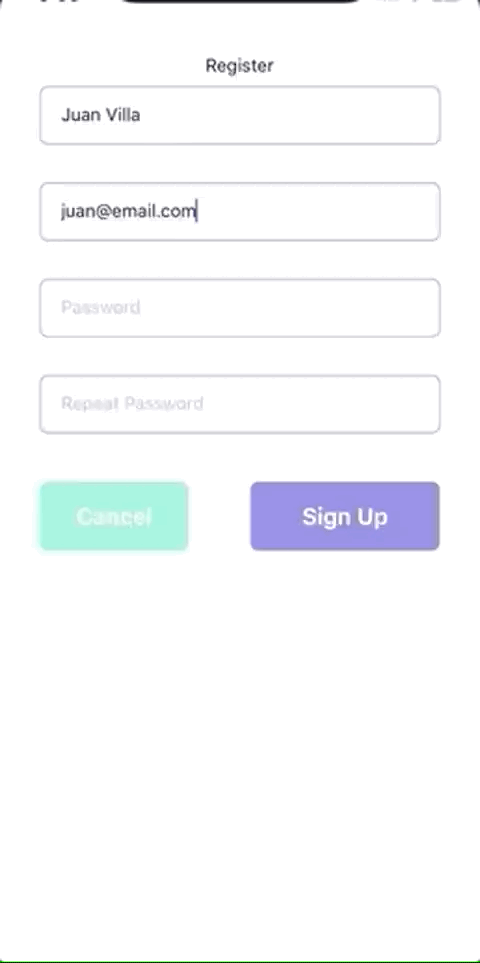
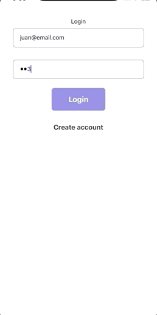
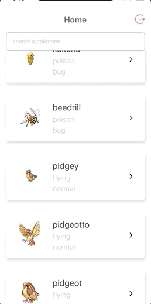
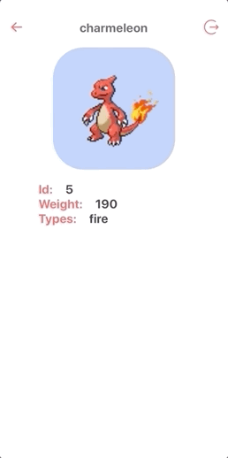

# pokedex
# Challenge
This app contains a Registration screen and also a login screen, once the user is logged in the app a scrollable list of pokemon will show up as main screen, these pokemon have been taken from `https://pokeapi.co/` free API. The list is displayed in individual touchable card. Each of these cards has the ability to navigate to the pokemon details.

## Developer notes:

The following packages were used to build the app:
- react-navigation.
- react-native-vector-icons.
- Asyncstorage to host the registered users and mantain the user session.

 ## Before we start

 Please make sure you have `node`, `npm`, `git`, `cocoapods` installed correctly. In case you don't have any of those installed and setup, please go to [nodejs.org](https://nodejs.org/en/) to download and install the **Recommended For Most Users** version, or go [here](https://git-scm.com/downloads) to download `git`. `cocoapods` can be set up following this [link](https://facebook.github.io/react-native/docs/integration-with-existing-apps).


 ## Setup

 ### React Native

 Please refer the [React Native docs Getting Started guide](https://facebook.github.io/react-native/docs/getting-started) over the **React Native CLI Quickstart** tab. There, you can see all the detailed setup processs for `Android` and `iOS` platforms.

 ### This Project

 Once the above parts are setup, you can go ahead and clone the repo using the following command in your terminal:
```
git clone https://github.com/jevvilla/pokedex.git
```
#### NOTE: please make sure you are in the correct branch, `dev` in this case.

Then go to the project root (project folder), and run the following commands to get the app running:

- `git checkout dev` to be placed in the correct branch.
- `npm install` - Install project dependencies.
- NOTE: don't forget install Pods, from the root path run `cd ios && pod install`.
- `react-native run-ios` - Run the app locally.  By default this will run an iPhone X simulator.
- `react-native run-android` - install to the single Android device connected (if more than one are connected, you must specify the device with `—deviceId` which can be gotten from `adb devices`).

Once `react-native run-ios` or `react-native run-android` finish up, you should be able to see app running.

## Screenshots
#### Register


#### Login


#### Home


#### Details and logout

